# Inventory Demo

[](https://www.apache.org/licenses/LICENSE-2.0)

This repo contains a simple Inventory tracking app for iOS and Android that can synchronise your Inventory Items between devices via Realm sync to our Atlas Server.

Checkout the README.md in each directory!

# License

Distributed under the Apache license. See ``LICENSE`` for more information.

# Welcome to the Realm Inventory Demo.   

## Tutorial Contents 
[Overview](#-overview)
1. [Create the Atlas Cluster](#-create-an-atlas-cluster)
2. [Configure the RealmSync Project](#-configure-the-realmsync-project)
3. [Set up the mobile development environment](#-set-up-the-mobile-development-environment)
4. [Import the Back Office Application](#-import-the-back-office-application)
5. [Host the HTML](#--host-the-html)
6. [Set up Twilio](#--set-up-twilio)
7. [Set up Charts](#--set-up-charts)
8. [Integrate with Kafka](#--integrate-with-kafka)


## Overview:
This demo has three distinct parts that interact to show end to end functionality of Realm and Atlas with other systems.  

- __sync:__ consits of a mobile demo with syncronized access to Atlas data.  
- __backOffice__ takes advantage of Atlas integration with serverless functions and triggers that interact with REST, Kafka and Twilio.   
- -> __html files__ inside the back office is a Realm hosted application written with dymanic HTML and the browser SDK to act as an admin console showing inventory items across all stores.


<a href="https://www.youtube.com/watch?v=S2KmEDq8-CI" target="video">Click for Video</a>
<a href="https://www.youtube.com/watch?v=S2KmEDq8-CI&feature=youtu.be" target="video">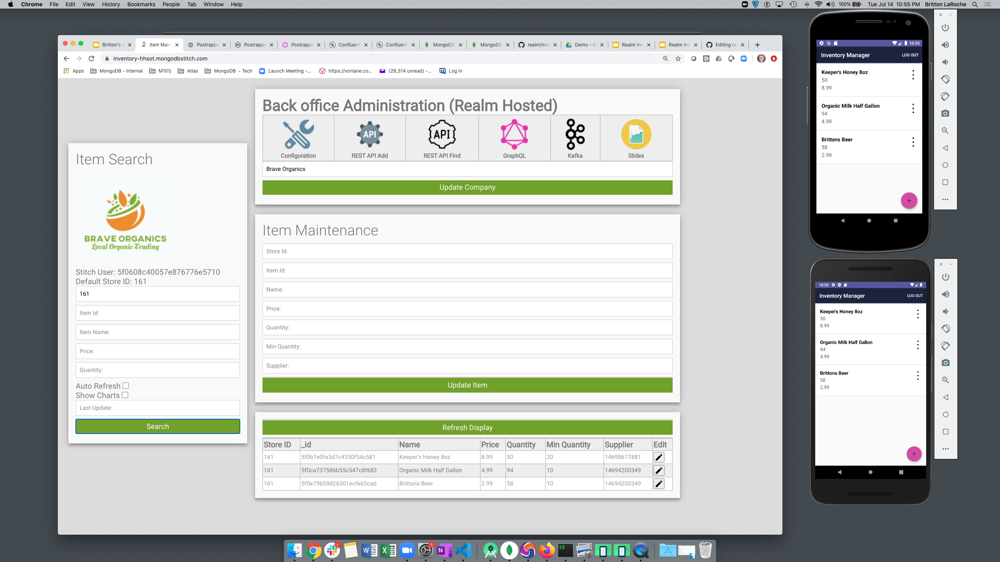</a>


This documentation is focused on helping you install and configure the Realm Demo.  Special thanks to __Nate Contino__ for creating the Realm Android mobile application written in Kotlin with Android studio.  Also special thanks to __Chris Grabosky__ who created a great GraphQL tutorial on how to connect to Atlas and use GraphQL.  Both of their githubs are linked below and will be used as part of this demo.

   

https://github.com/nathan-contino-mongo/inventory-system  
https://github.com/pmanna-tse-realm/inventory-system   
https://github.com/graboskyc/MongoDBStitchGraphQL   


This project integrated mobile devices with an Atlas cluster and allows for seamless synchronization of mobile data with the MongoDB Atlas database running in the cloud. Additionally it shows how to use realm functions and triggers to integrate with other cloud providers and tools such as Kafka running in the Confluent Cloud, or being able to send an SMS message through twilio to any mobile device. This demonstration shows how to create rest, and GraphQL endpoints for integration with business to business or business to customer consumers allowing third party applications to query data stored in Atlas across all mobile devices. As data is changed in Atlas it is automatically synchronized with the mobile devices.   

We show how all the pieces fit together in the Orthogonal Diagram below.


## Diagram
<a href="https://docs.google.com/presentation/d/e/2PACX-1vRjgoyZ7EWCBecjxbUL2w6lXcqhRegQohptNAh8TY2FDBRUi2DfN9wecihJOVcxP4aqVeU5UNeI4a5X/pub?start=true&loop=true&delayms=100" target="animation">Click for animation</a>
<a href="https://docs.google.com/presentation/d/e/2PACX-1vRjgoyZ7EWCBecjxbUL2w6lXcqhRegQohptNAh8TY2FDBRUi2DfN9wecihJOVcxP4aqVeU5UNeI4a5X/pub?start=true&loop=true&delayms=100" target="animation">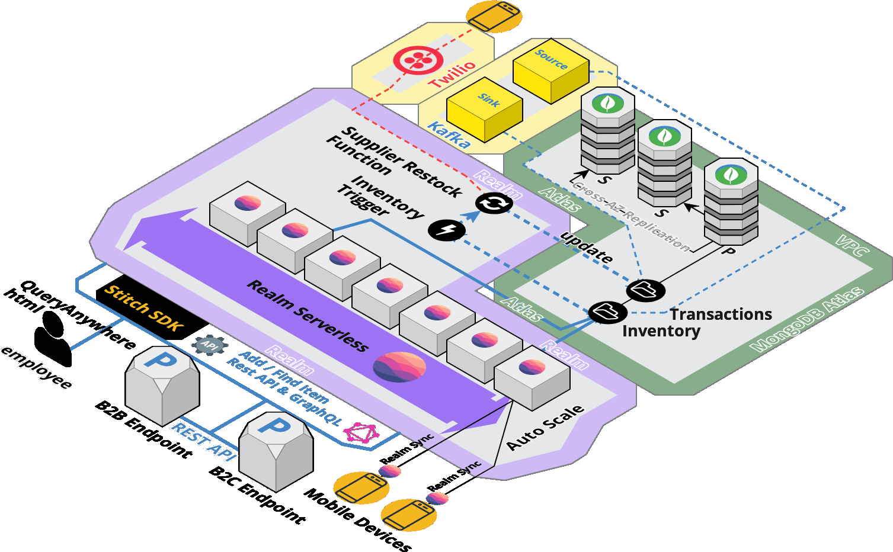</a>


## Philosophy   
We believe that there is power in simpliclicity.  We did not include any frameworks and kept to a minimalist "hand rolled" design to showcase functionality.  To that end when forced to make a choice on a mobile development platform we chose Android Kotlin as we felt it was the easiest for a new developer to work with. Additionally Kotlin compiles to native code and has a light foot print on the mobile device in terms of CPU, Memory and Battery consumption.   

The vast majority of handheld devices manufactured for use in commercial applications in our experience are using Android for two primary reasons, lower costs and greater configurability. Because of its open software which allows it to run on multiple devices, Android provides greater flexibility to design a customized look and feel as well as greater control of the components used in manufacturing to determine the mobile device performance.   

Finally, the barrier to entry as a mobile developer is much higher for iOS development as it requires upgrading to the latest version of the Mac OS just to install Xcode. Once installed, the security certificate set up is not intuitive, and no development can begin until the certificates have been set properly.  For these reasons we went with a simple Android Kotlin application for this demo.  That being said Realm supports iOS development.

Realm supports iOS and a wide variety of mobile platforms. [The MongoDB Realm Documentation](https://docs.mongodb.com/realm/) has great tutorials on getting started with React Native, and iOS as well as other development platforms.  Palo Manna has created an iOS version of this app here:https://github.com/pmanna-tse-realm/inventory-system

Its an 8 step process to install the end to end Realm Inventory System Demo.  The following sections walk us through each step in great detail.  Its not a difficult process but it does require following a prescribed set of steps to be successful.  Estimated time to completion about 60 to 90 minutes.  Each step yields its own independent results so you will see great progress and powerful features along the way.

##  Create an Atlas Cluster
Our first step is to create an atlas cluster. Create a free tier cluster known as an M0. __Realm Sync requires MongoDB version 4.4__ and it is now available on the free tier.  Additionally we have more than 5 triggers in our demo. If you are interested in using the Atlas Kafka connector through Confluent Cloud you will want to create an AWS cluster in East US 2.  You can always migrate your cluster to this region in the future.

__NOTE: REALM SYNC REQUIRES ATLAS 4.4 OR GREATER IF YOU DON'T USE 4.4 YOU HAVE TO START OVER AT STEP 1__

Click the following link https://cloud.mongodb.com to sign up. Additional instructions on creating an Atlas cluster are available here: [Atlas getting started Guide](https://docs.atlas.mongodb.com/getting-started/)  

When you create your account you will be asked to create a project.  If you have gone with the default __"Project0"__ then create a new project and name it __"RealmDemo"__.  This is not necessary, but it is good form to clearly identify what your project is.

##  Configure the RealmSync Project   
We have two options to create the realm sync Atlas project.  One is to import the existing project in this github, and the other is to create it by hand.  To import the realm project follow the instructions outlined in step 4.  When you get to step 4.4 execute the following code to link the sync project... the path __"/realm-master/inventoryDemo/export/sync"__ is the only change.

<a href="https://youtu.be/RC36sO0HgdU" target="video">Click for a short video on importing the application</a>
<a href="https://youtu.be/RC36sO0HgdU" target="video">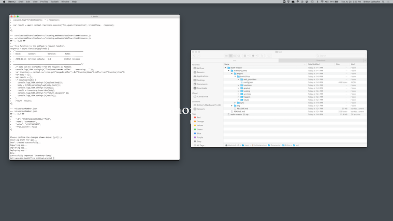</a>

```
realm-cli import --path=./realm-master/inventoryDemo/export/sync --strategy=replace
```   
or cd to the ./realm-master/inventoryDemo/export/sync directory and run   
```
realm-cli import --strategy=replace
```   

Be sure to copy the APPID value in the upper left (click the copy button next to the InventorySync name) and save the value for Step 3.4 Below.

__NOTE: YOU DO NOT NEED TO DO ANY OF THE REST OF THE STEPS IN SECTION 2 IF YOU IMPORT THE APP. GO TO SECTION 2.6 AND CREATE USER ACCOUNTS__

#### 2.1. Creating the inventorySync project Manually.
If you wish to create the SYNC application from scratch follow the next few steps in section 2. To start the sync process we need to create an Atlas realm application to sync data from the mobile device to the Atlas database.  We start by clicking the "__Realm__" tab in the upper middle tab of the Atlas console.  Then we select the green __"Create a New App"__ button in the upper right.

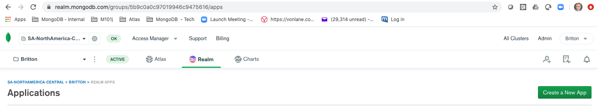

#### 2.2. Name the App InventorySync  
This brings up the __"New Application"__ Dialog window.  We give the application a name __"InventorySync"__ and select our atlas cluster to link the application.  Then we press the Create Realm Application Button.   
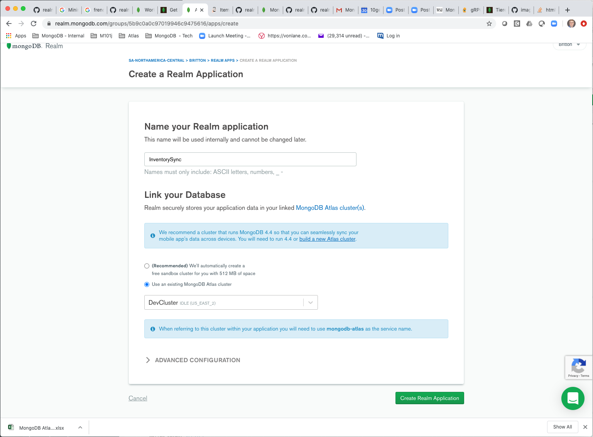

#### 2.3. Copy the AppID   
When the application is created we need to copy the AppID into our clipboard and save it for later use when connecting our mobile device to Atlas. Click the copy button next to the __InventorySync__ name at the upper left of the realm console window and save the value for Step 3.4 Below. 
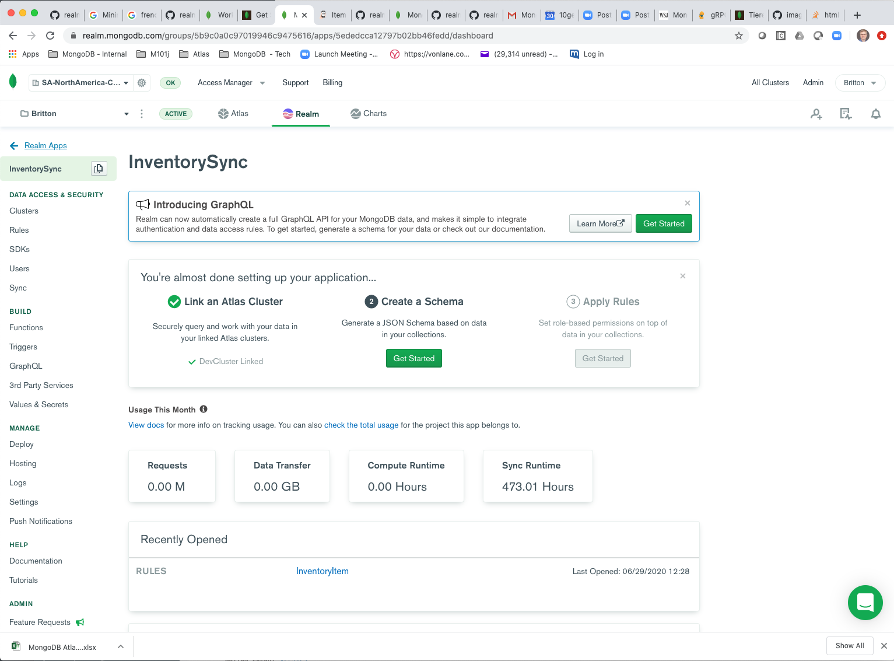

#### 2.4. Creating the Schema   
Next we create a schema for our mobile application. Selected the rules tab and create a new rule for a database "InventoryDemo" and a collection "InventoryItem." Next click on the schema tab and copy the schema below into the schema for the application.  This schema is responsible for translating the Realm Objects stored on the mobile devices to JSON documents on the Atlas server and vice versa.  The schema can be generated two other ways, one from existing data in Atlas, or another by going into development mode on the __sync__ window launched by selecting the __sync__ menu item on the left navigation panel of the Realm console.


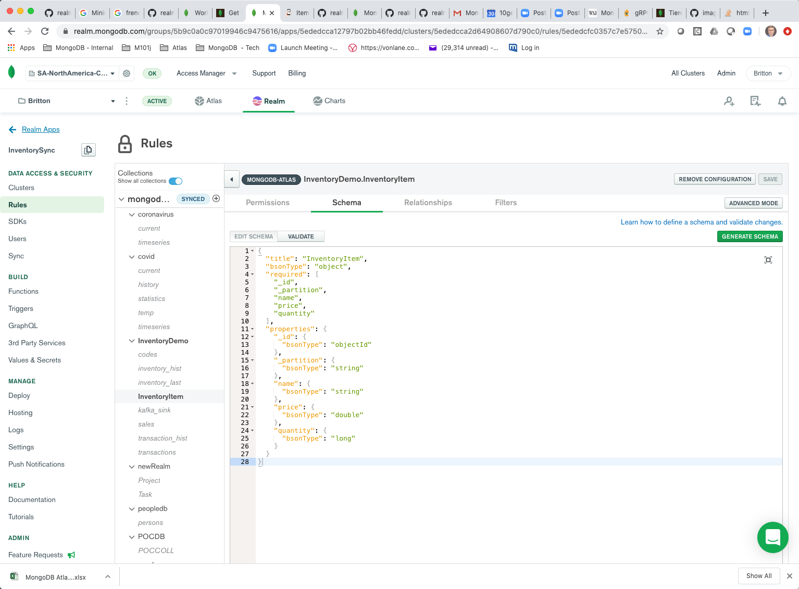
```js
{
  "title": "InventoryItem",
  "bsonType": "object",
  "required": [
    "_id",
    "_partition",
    "name",
    "price",
    "quantity"
  ],
  "properties": {
    "_id": {
      "bsonType": "objectId"
    },
    "_partition": {
      "bsonType": "string"
    },
    "name": {
      "bsonType": "string"
    },
    "price": {
      "bsonType": "double"
    },
    "quantity": {
      "bsonType": "long"
    }
  }
}
```

#### 2.5. Turn on Sync   
Now that we have created our schema we are ready to turn on Sync.  CLick on the "__Sync__" menu item on the left hand navigation menu of the Realm console.  The Sync configuration window appears and we specify the cluster to sync with and the partition key as well as define permissions.  Use __" \_partition"__ as the partition key and leave the permissions to the default empty document __"{}"__

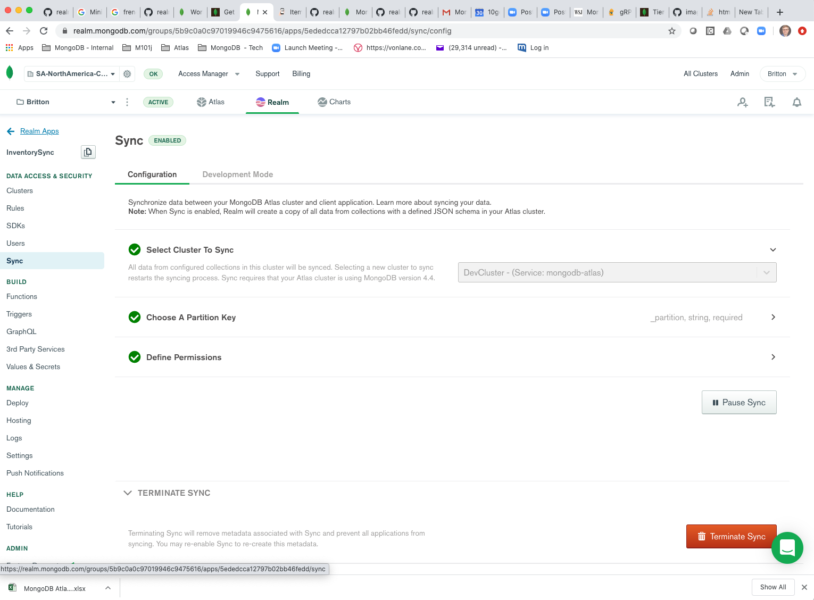

We are now ready to sync our mobile application.  Start the sync process by saving the config and pressing the start sync button and deploy the changes.  If for any reason sync seems to fail feel free to pause sync, deploy the changes.  After a few moments start sync again and deploy the changes.  Terminating sync requires rebuilding the schema and starting over.

#### 2.6. Create some user accounts
There are many ways to authenticate to Realm from the mobile device. For our inventory demo we will create some users that will authenticate via email and password.  Begin by selecting the __"Users"__ menu item from the left Navigation menu pane of the Realm console.  This brings up the Realm Users window.  Click on the providers tab.  We see many ways that users can authenticate.   Click on __"Email / Password."__   

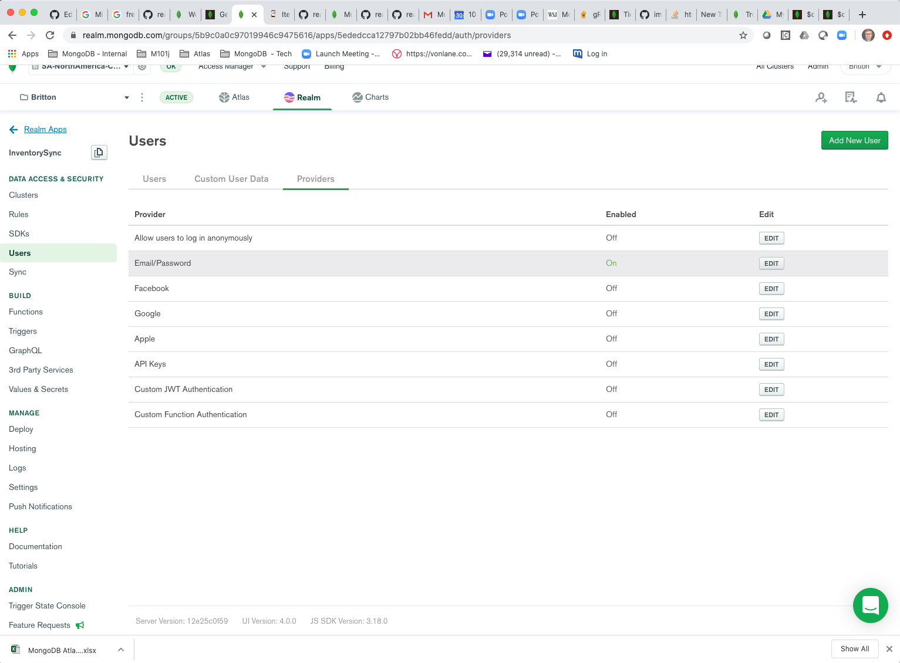

Set the provider __"Enabled"__ to __"On"__ by moving the slider.  Select __"Automatically Confirm Users"__ and choose a password reset function, then select __"Create New Function"__ go with the default reset function and then save.

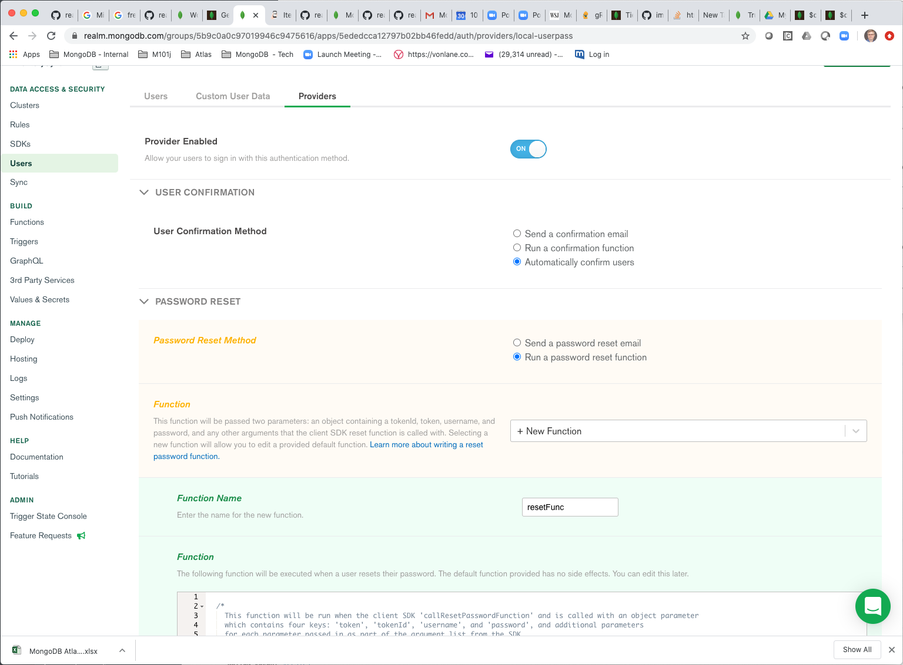

Now we create several new users.  These will be the users that log in through the mobile devices.  For our demo we created the following users, one at a time.  The username is an email address.

__demo_user@gmail.com__   
__demo_user1@gmail.com__   
__demo_user2@gmail.com__      
   
   
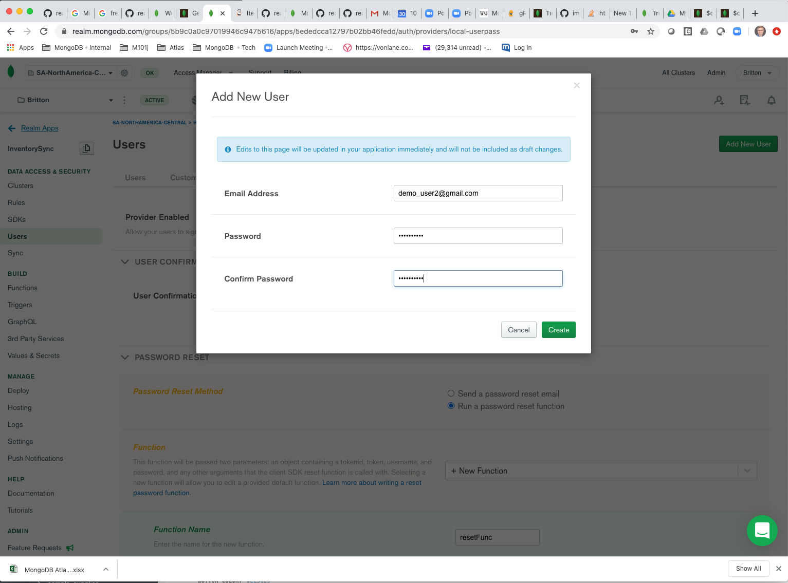

## Tutorial Contents 
[Overview](#-overview)
1. [Create the Atlas Cluster](#-create-an-atlas-cluster)
2. [Configure the RealmSync Project](#-configure-the-realmsync-project)
3. [Set up the mobile development environment](#-set-up-the-mobile-development-environment)
4. [Import the Back Office Application](#-import-the-back-office-application)
5. [Host the HTML](#--host-the-html)
6. [Set up Twilio](#--set-up-twilio)
7. [Set up Charts](#--set-up-charts)
8. [Integrate with Kafka](#--integrate-with-kafka)

##  Set up the mobile development environment  

#### 3.0. Install Android Studio  
The first step to start developing Android Apps is to download Android Studio 4.0 (minimum required version is 4.0) [here](https://developer.android.com/studio). 

#### 3.1. Download the Android Inventory project from github  
Once you have installed Android Studio you will need to download and install the mobile application from this github: https://github.com/nathan-contino-mongo/inventory-system

Move the zip file to the folder of your choice. Double click the zip file and unzip the contents. Open android studio.  

#### 3.2. Open the Inventory project 
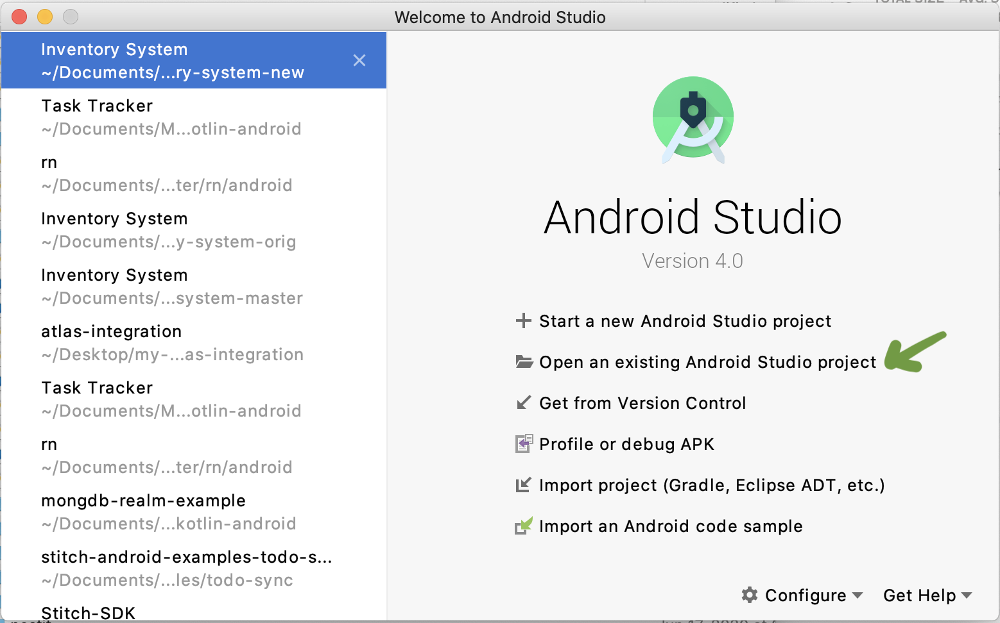

When android opens a small popup window opens.  Select the "Open Existing Project" open the folder where you installed the zip file /inventory-system-master.  

#### 3.3. Syncronize the Gradle Scripts 
The project will load and a small staus window will ask you to syncronize the gradle files.  Chose the options to syncronize.  If you miss the prompt you can select File / Sync Project with Gradle Files.

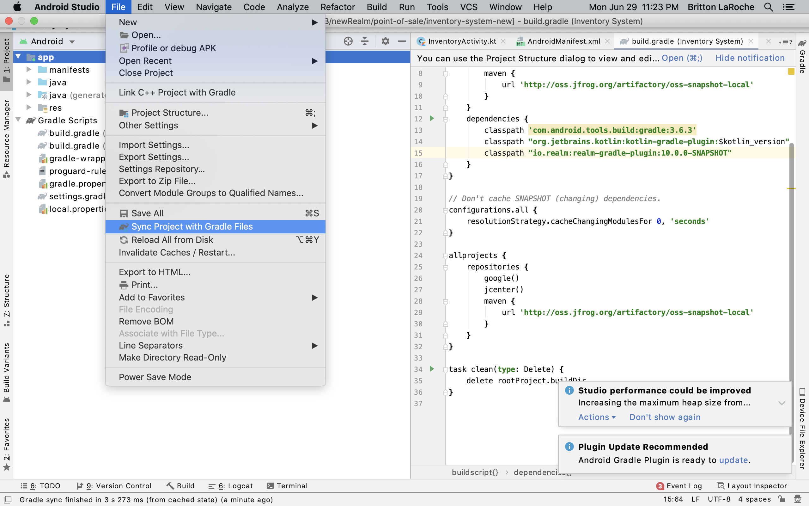    

#### 3.4. Set the AppId 
On the left hand navigation pane and expand the __Gradle Scripts__ and select the build.gradle(Module: app) file.  Find the appId variable and set it to the realm sync project AppId configured in step 2.

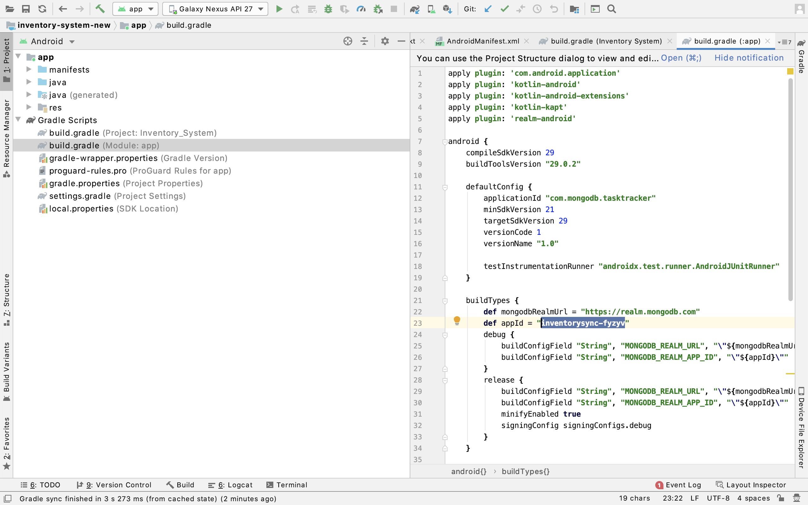   

#### 3.4. Install Android SDK 10.0 API Level 29 
Ah, the sheer joy of working with android mobile apps begins with the all the dependencies!  Now we need to download the android sdk 10.0 API level 29. Click the menu popup in the lower right telling you that you need to install the new Android SDK API level 29 for this project and install it.  In case you missed the subtle prompt at the bottom right to install the SDK 10 API Level 29, and you did not click to install, you have another option by going to the menu bar and selecting __Tools > SDK Manager__   

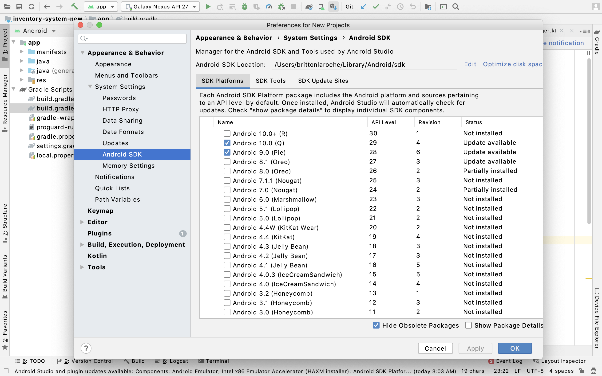  
 
After the SDK 10.0 with API level 29 has installed you will notice that the build has begun.  You can click the build tab at the lower left to see it running.

#### 3.5. Install Android Virtual Devices
The final step is to download at least 3 different android virtual devices.  I prefer a Galaxy, Nexus and a Pixel.  The AVD's can be managed and downloaded from the AVD Manager located in the main menu under __Tools > AVD Manager__

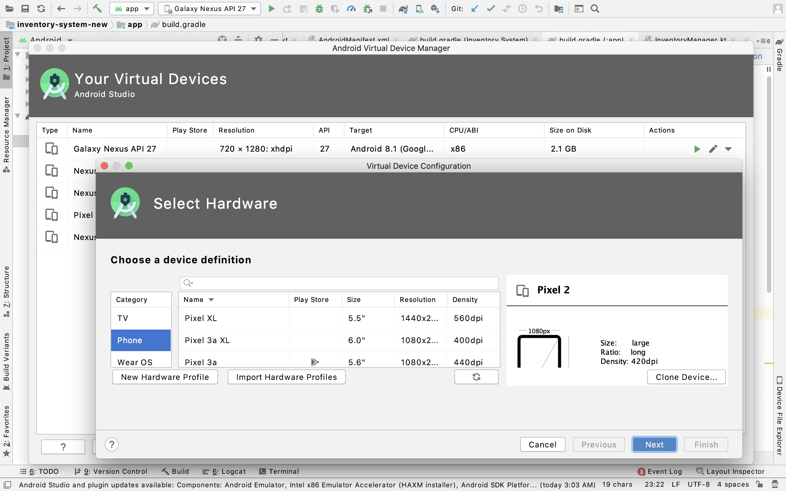  

#### 3.6. Launch the Android Application
You can run the Inventory Demo on a single AVD.  Just press the green arrow on the toolbar and it will run the AVD selected in the drop list to the left.  However to show synchronization to Atlas and then back to multiple devices you may want to run the application on multiple AVDs.


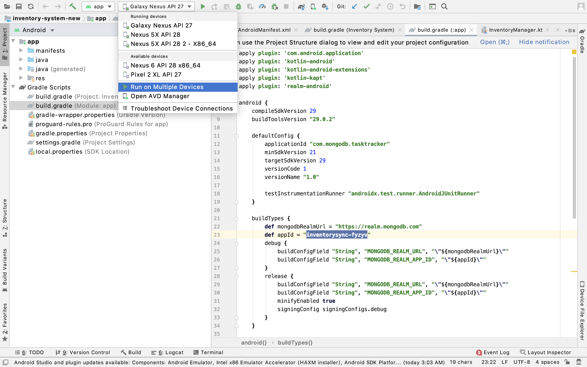  


#### 3.7. Run on Multiple Devices
Once the dialog is open, select two or three devices to run the demo on.  It is helpful to show synchronization across devices. I typically have two devices in the same store and one device in another store.  I like to show how changing the Store ID in the Item Maintenance console can move items off of the current stores device and have it added to the other stores device in real time.

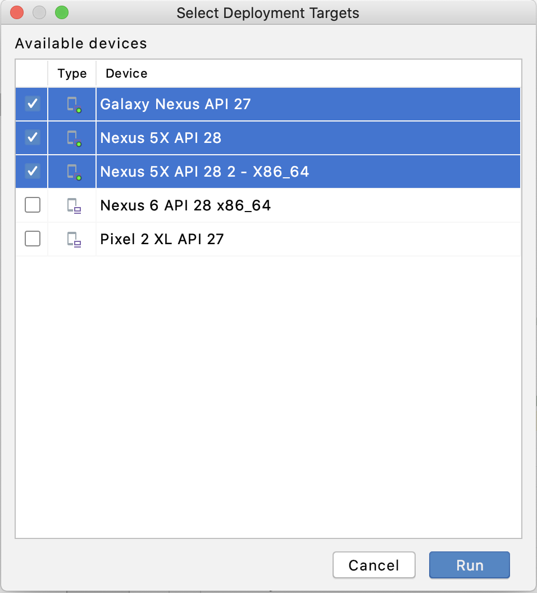   

Once you have the AVDs selected click the run button.  

#### 3.8. Connect to Atlas via Realm Authentication
When the AVDs Launch, you can log in with the user name (email address) and passwords you defined in step 2.6.  Login in with demo_user@gmail.com and the Store ID (\_partition) for your demo.


I prefer two in one store to show synchronization.  The third AVD is nice to show an inventory item transferred from one store to another, or the fact that different stores have different inventories, and that the user sees the inventory relevant to his or her store.

## Tutorial Contents 
[Overview](#-overview)
1. [Create the Atlas Cluster](#-create-an-atlas-cluster)
2. [Configure the RealmSync Project](#-configure-the-realmsync-project)
3. [Set up the mobile development environment](#-set-up-the-mobile-development-environment)
4. [Import the Back Office Application](#-import-the-back-office-application)
5. [Host the HTML](#--host-the-html)
6. [Set up Twilio](#--set-up-twilio)
7. [Set up Charts](#--set-up-charts)
8. [Integrate with Kafka](#--integrate-with-kafka)

##  Import the "Back Office" application

#### 4.0. Download the realm github repository
Begin by downloading the zip file or performing a check out of the [realm inventory application in this github](https://github.com/brittonlaroche/realm) The easiest method is to select the green clone button and download a zip file.  Take the zip file and unzip it in a directory of your choice.

<a href="https://youtu.be/RC36sO0HgdU" target="video">Click for a short video on importing the application</a>
<a href="https://youtu.be/RC36sO0HgdU" target="video"></a>   

The following section shows how to import the application via this GitHub and the stitch command line tool __"realm-cli"__. Knowledge of how the stitch command line works is important as you can integrate realm-cli with your CICD (continuous integration and continuous delivery) tools.  This allows you to work in your native development environment, commit changes to GitHub and then deploy and test as you would normally through your CICD work flow. A good overview of the stitch command line tool is provided here: [Stitch Command Line Blog Overview](https://www.mongodb.com/blog/post/mongodb-stitch-command-line-interface)


#### 4.1. Install the realm-cli tool
Begin by [Installing the Realm Command Line Interface tool](https://docs.mongodb.com/realm/deploy/realm-cli-reference/#installation)

__NPM__   
```
npm install -g mongodb-realm-cli
```

__Yarn__   
```
yarn global add mongodb-realm-cli
```

#### 4.2. Create a project API key
Next [Create a Project API key](https://docs.atlas.mongodb.com/configure-api-access/#programmatic-api-keys).  When you create the API key be sure to give yourself the __"Project Owner"__ role as you will need this to import the stitch application. Additionally, be sure to whitelist your current ip address.  Right click this link [Create a Project API key](https://docs.atlas.mongodb.com/configure-api-access/#programmatic-api-keys) open in new tab. Follow instruction under __Manage Programmatic Access to a Project__ perform each step listed in the section __Create an API Key for a Project__ be sure to copy the private API key somewhere safe for future reference.


Its a bit tricky to get started as there are two types of API keys, one for Organizations and one for Projects.  We need to create an API key for our __project__. Begin by selecting the __Realm__ tab in the Atlas console.  This should display a list of realm applications.  When we are finished, we will have two realm applications as seen below: __InventorySync__ and __Inventory__.  

At this point we have only created the __InventorySync__ application created.  To generate the appropriate API key click the __"Access Manager"__ drop list and select __"Project Access"__   

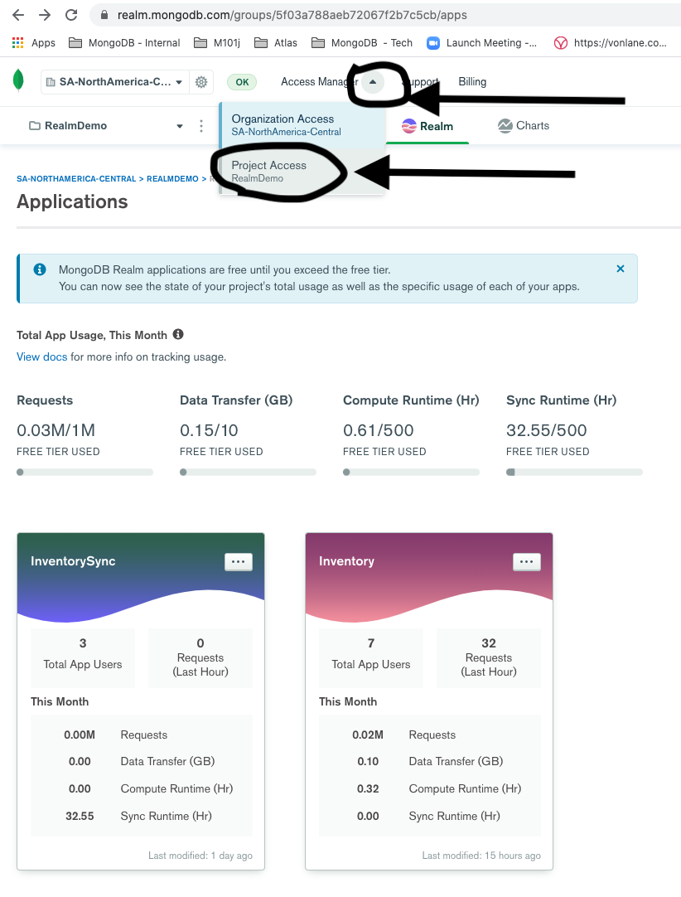   

After clicking the __"Access Manager"__ drop list and selecting __"Project Access"__ We should be presented with the Project Access Manager console as seen below. 

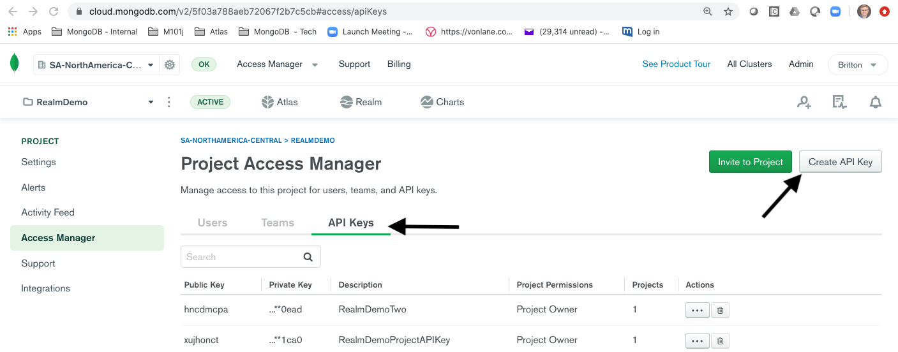

Click the __"API Keys"__ tab and then click the __"Create API Key"__ button.   

Be sure to give project owner access.  Copy the private key to a safe location where you can keep it for future use.

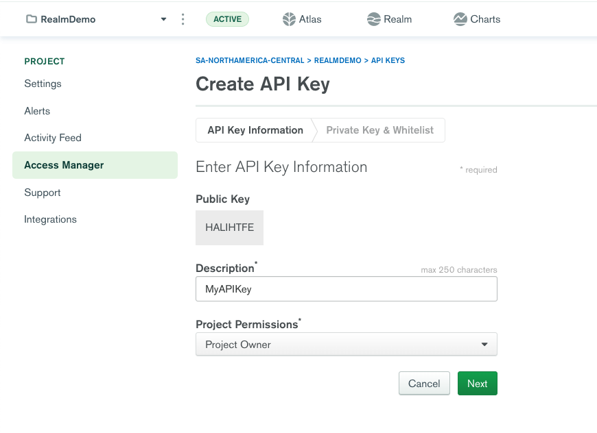

Also be sure to whitelist your current IP address, click the next button to do so.

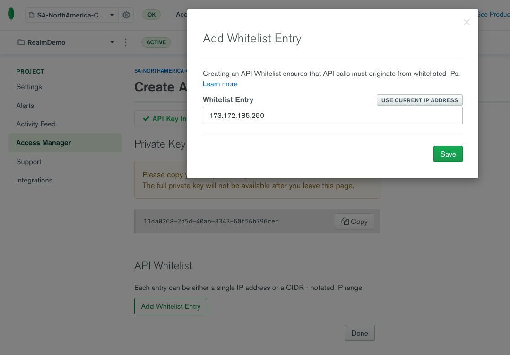

When finished whitelisting IP addresses click __"done"__.   
Congratulations, You now have an API key for command line access into your Realm project!   


#### 4.3. Log in via realm-cli
log into your atlas cluster with your API key (public and private keys) with the stich command line tool.

Sample login instructions:
```
realm-cli login --api-key=my-api-key --private-api-key=my-private-api-key
```

Example login (Don't worry its not a real api key):
```
realm-cli login --api-key=ytqictxq --private-api-key=8137b118-4a36-4197-a3c7-23b73ba49775
←[0;0myou have successfully logged in as ytqictxq←[0m
```

#### 4.4 Import the inventory back office application
After logging in the command line maintains the connection until you execute the command __realm-cli logout__.  We are now ready to import the application. The following command below should work.  Navigate to the folder where you unzipped the realm github zip file in step 4.0. 
```
realm-cli import --path=./realm-master/inventoryDemo/export/backOffice --strategy=replace   
```   

...or cd to the backOffice directory and run 

```
realm-cli import --strategy=replace
```
Follow the prompts and respond __y__ when asked if you would like to create a new app. Press enter to accept the default values.  Change the values to match your configuration. Expect an error...


#### 4.4.1 Create a Supplier Secret Value for Twilio
__DON't PANIC__ After you receive the error that the Import failed because we didn't have a SupplierSecret, we will create a SupplierSecret value to be updated later.  (We can't have our secrets in github)

https://docs.mongodb.com/realm/deploy/realm-cli-reference/#create-a-secret   

We need to create a supplier secret for Twilio that we will update later in order to import the back office application.  Once we have logged in we run the following command:

```
realm-cli secrets add --name SupplierSecret --value=TobeUpdated
```   

Again we import...   

```
realm-cli import --path=./realm-master/inventoryDemo/export/backOffice --strategy=replace   
```   

...or cd to the backOffice directory and run 

```
realm-cli import --strategy=replace
```

Follow the prompts and respond __y__ when asked if you would like to create a new app. Press enter to accept the default values.  Change the values to match your configuration.  An example is provided below.  You may get another error...

```
realm-cli import \path=./realm-master/inventoryDemo/export/backOffice --strategy=replace
←[0;0mUnable to find app with ID: "invnetory-ekqoy": would you like to create a new app? [y/n]:←[0m y
←[0;0mApp name [inventory]:←[0m
←[0;0mAvailable Projects:←[0m
←[0;0mProject 0 - 5ce58a9fc56c98145d922e93←[0m
←[0;0mAtlas Project Name or ID [Project 0]:←[0m
←[0;0mLocation [US-VA]:←[0m
←[0;0mDeployment Model [GLOBAL]:←[0m
←[0;0mNew app created: inventory-vibtf←[0m
←[0;0mImporting app...←[0m
←[0;0mDone.←[0m
←[0;0mSuccessfully imported 'inventory-vibtf'←[0m

realm-cli logout

```
If you get an error: __app already exists with name "Inventory"__ then the replace option did not work as expected.  Feel free to click on the realm tab and delete the existing inventory application displayed.

If you named your cluster anything other than the default __"Cluster0"__ then you will need to modify a json document to reflect your cluster name. The document is located in your directory here: /realm-master/inventoryDemo/export/backOffice/services/mongodb-atlas/config.json

If you named your cluster "DevCluster" for example you would change the __"clusterName":__ field from __"Cluster0"__ to __"DevCluster"__.  An example has been provided below.

```

{
    "id": "5d218cb4e0601bec3de065c7",
    "name": "mongodb-atlas",
    "type": "mongodb-atlas",
    "config": {
        "clusterName": "DevCluster",
        "readPreference": "primary",
        "wireProtocolEnabled": false
    },
    "version": 1
}
```
Once you save your changes you are ready to try the import again.

### 4.5 Set up user accounts
Follow the same process as in [2.6 Set up User accounts](#26-create-some-user-accounts)  We will be creating back end users that have different access to the data than the front end mobile users.  Creating two sets of users gives us greater ability to create and control who has access to what data.  

## Tutorial Contents 
[Overview](#-overview)
1. [Create the Atlas Cluster](#-create-an-atlas-cluster)
2. [Configure the RealmSync Project](#-configure-the-realmsync-project)
3. [Set up the mobile development environment](#-set-up-the-mobile-development-environment)
4. [Import the Back Office Application](#-import-the-back-office-application)
5. [Host the HTML](#--host-the-html)
6. [Set up Twilio](#--set-up-twilio)
7. [Set up Charts](#--set-up-charts)
8. [Integrate with Kafka](#--integrate-with-kafka)

##   Host the HTML

 We will need to modify the files in the following directory.  The next few steps will be to replace the default appId __"inventory-hhsot"__ your to your new application id in many of the html files.  Once we are finished we will need to upload them to the hosting directory.  At the time of the writing of this readme, the hosting import does not work correctly and we need to reset hosting as well.    
 
<a href="https://youtu.be/sdHcQYlMUm0" target="video">Click for a short video on hosting the application html</a>
<a href="https://youtu.be/sdHcQYlMUm0" target="video">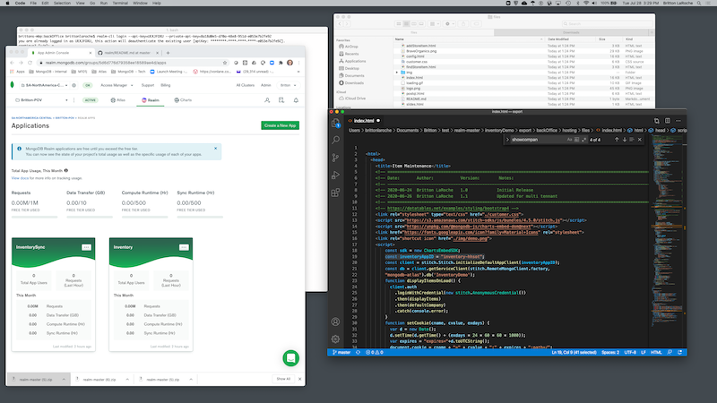</a>
 
Begin the process by navigationg to the following directory:
```
realm-master/inventoryDemo/export/backOffice/hosting/files/
```

First get your application id from the atlas console.  If you need to click the "Realm" tab and open the inventory application by clicking on the icon.  When in the realm inventory application console select the copy button next to the Application ID in the upper left navigation pane.  An image is provided below.  You may need to click the copy button several times.

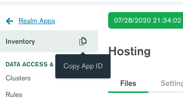


We will edit the following files:

### addStoreItem.html
line 32
```
value="https://webhooks.mongodb-stitch.com/api/client/v2.0/app/inventory-hhsot/service/addStoreItemService/incoming_webhook/addStoreItemWH"/></td></tr>
```   
Again, we are changing __"inventory-hhsot"__ to your AppId in the string above.  If your AppId is __"inventory-abcde"__ then your edit would look like the following:   
```
value="https://webhooks.mongodb-stitch.com/api/client/v2.0/app/inventory-abcde/service/addStoreItemService/incoming_webhook/addStoreItemWH"/></td></tr>
```   


### config.html
line 17
```
const client = stitch.Stitch.initializeDefaultAppClient('inventory-hhsot');
```   

### findStoreItem.html
line 32
```
            value="https://webhooks.mongodb-stitch.com/api/client/v2.0/app/inventory-hhsot/service/findStoreItemsService/incoming_webhook/findStoreItemsWH"/></td></tr>
```   

### index.html
line 19
```
const inventoryAppID = "inventory-hhsot";
```

### postql.html
lines 31-32
```
          <tr><td style="padding: 10">URL:</td><td> <input style="min-width: 1000px;" type="text" id="input_url" name="input_url" 
            value="https://stitch.mongodb.com/api/client/v2.0/app/inventory-hhsot/auth/providers/local-userpass/login"/></td></tr>
```   
lines 55-56   
```
          <tr><td style="padding: 10">URL:</td><td> <input style="min-width: 1000px;" type="text" id="input_qlurl" name="input_qlurl" 
            value="https://stitch.mongodb.com/api/client/v2.0/app/inventory-hhsot/graphql"/></td></tr>
```   
Save all the edits and then open the hosting console by selecting the __"Hosting"__ menu item from the left navigation pane of the Realm console window.

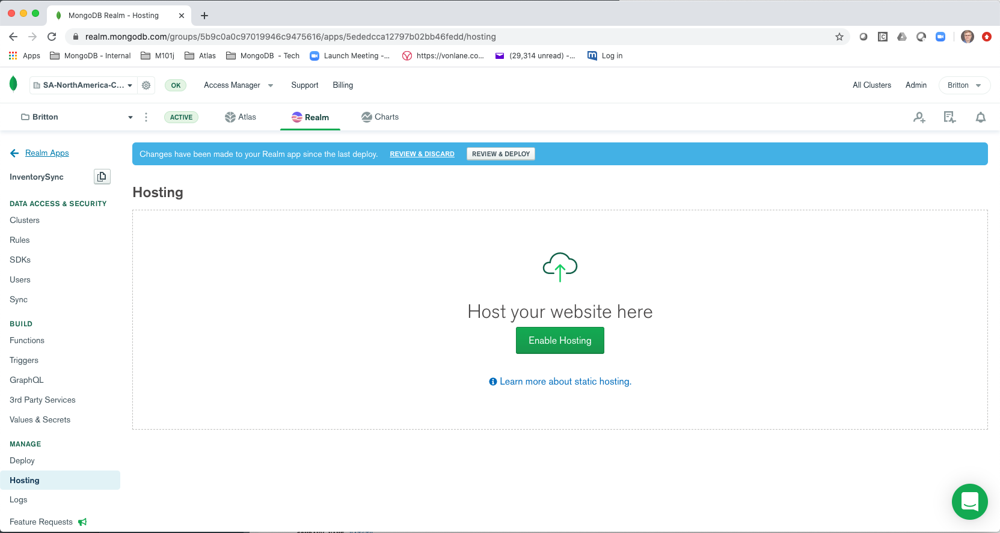  

Be sure to enable hosting. If you see the error message __"Invaild directory"__ you need to click on the __"Settings"__ tab and disable hosting.  Then enable hosting again. Once hosting is enabled click the upload button and load all of the files in the following directory.

```
realm-master/inventoryDemo/export/backOffice/hosting/files/
```   

Once the HTML files are loaded we create a new /img dirctory in the __"Hosting"__ console window by pressing the green __"+ Create Folder"__ button.

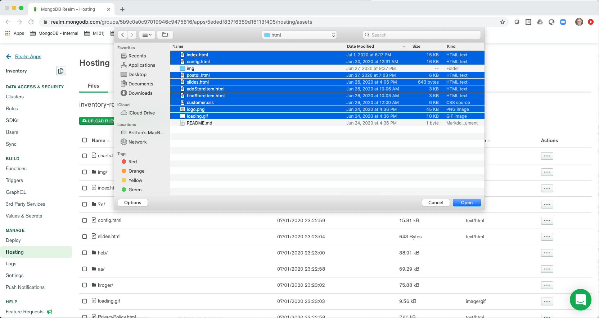  

Once the img directory is created open it and navigate to the image directory in the following directory.
```
realm-master/inventoryDemo/export/backOffice/hosting/img/
```   

Upload all of the image files into the hosted img directory.  When finished press the __"Review and Deploy"__ button to ensure all of the changes are deployed on your server.


## Tutorial Contents 
[Overview](#-overview)
1. [Create the Atlas Cluster](#-create-an-atlas-cluster)
2. [Configure the RealmSync Project](#-configure-the-realmsync-project)
3. [Set up the mobile development environment](#-set-up-the-mobile-development-environment)
4. [Import the Back Office Application](#-import-the-back-office-application)
5. [Host the HTML](#--host-the-html)
6. [Set up Twilio](#--set-up-twilio)
7. [Set up Charts](#--set-up-charts)
8. [Integrate with Kafka](#--integrate-with-kafka)

##   Set up Twilio
Twilio Response webhook is on twilio side...
https://webhooks.mongodb-stitch.com/api/client/v2.0/app/inventory-hhsot/service/SupplierService/incoming_webhook/TwilioWH
in SMS
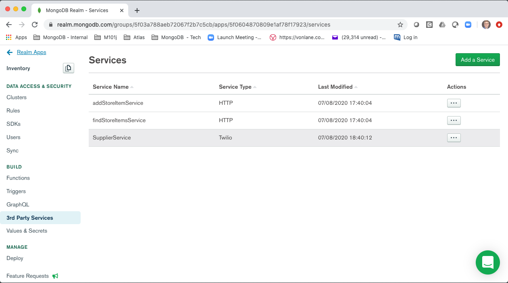 
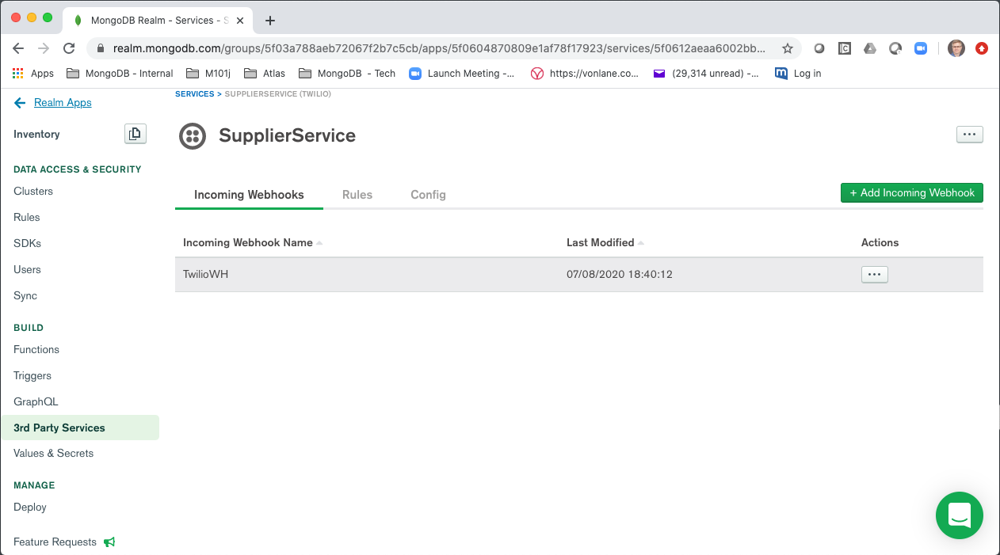 
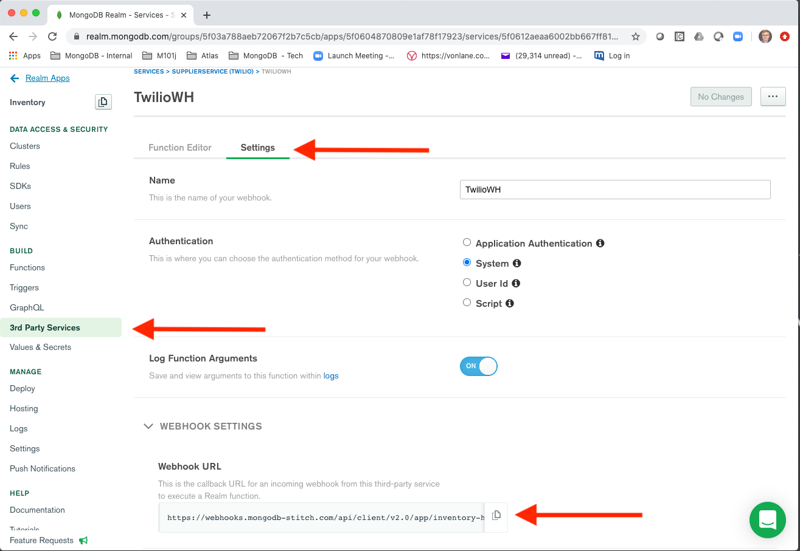 

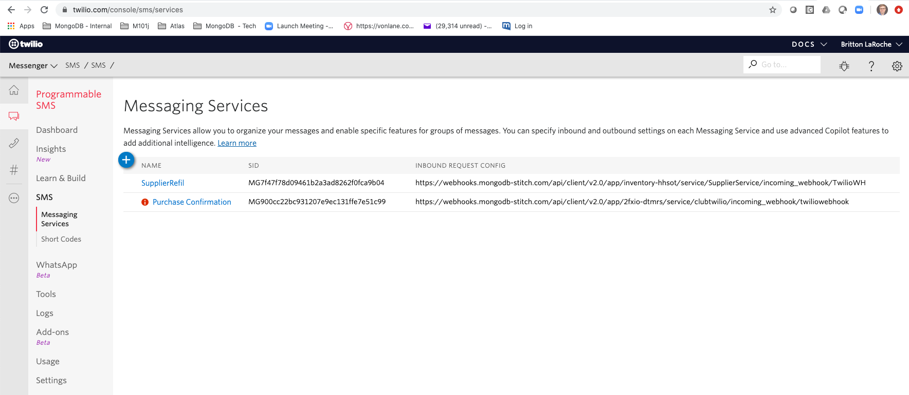 
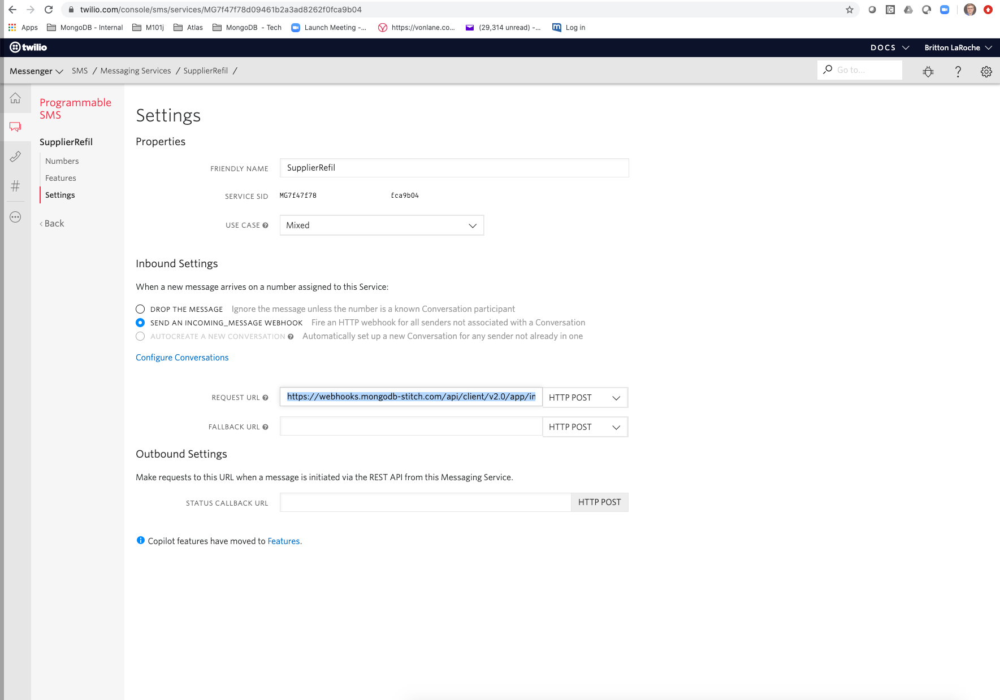 
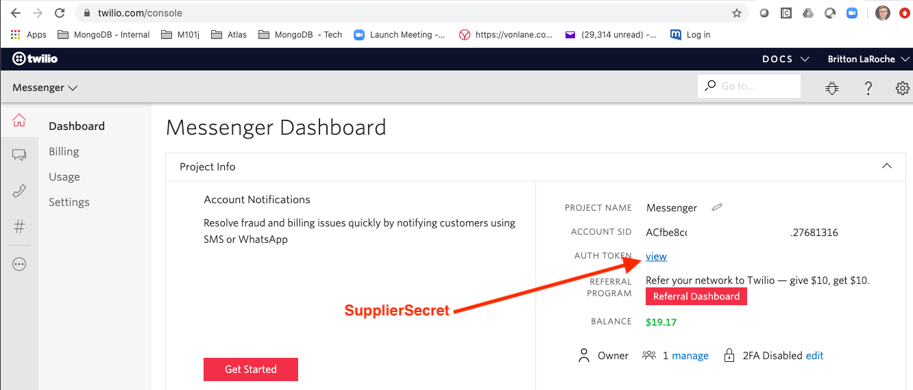 
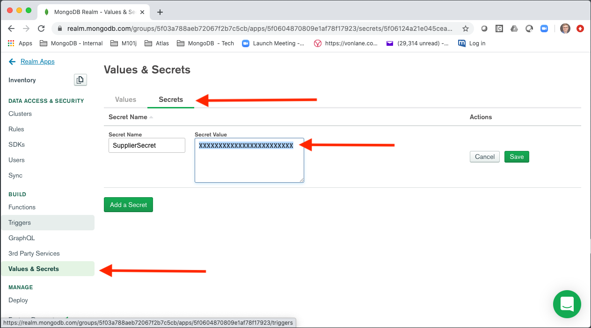 
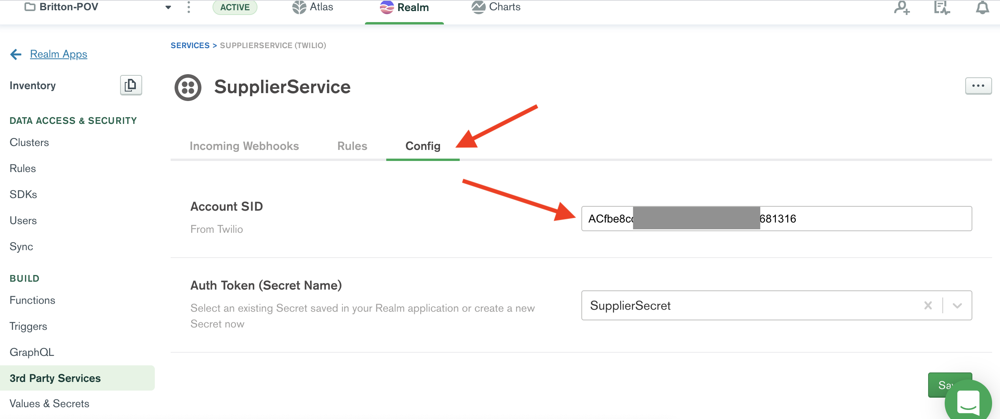 

## Tutorial Contents 
[Overview](#-overview)
1. [Create the Atlas Cluster](#-create-an-atlas-cluster)
2. [Configure the RealmSync Project](#-configure-the-realmsync-project)
3. [Set up the mobile development environment](#-set-up-the-mobile-development-environment)
4. [Import the Back Office Application](#-import-the-back-office-application)
5. [Host the HTML](#--host-the-html)
6. [Set up Twilio](#--set-up-twilio)
7. [Set up Charts](#--set-up-charts)
8. [Integrate with Kafka](#--integrate-with-kafka)

##   Set up Charts

The entire process for setting up charts is covered in the video below.  It is highly recommended to watch the video as a number of topics are covered quickly in the video to get you started. The steps are outlined in the section below but will make a lot more sense when given the context shown in the video.  The official Mongo DB Charts documentation is [Here](https://docs.mongodb.com/charts/master/)

<a href="https://youtu.be/MIoWkp_oCBs" target="video">Click for a short video on creating charts and embedding them in the application</a>
<a href="https://youtu.be/MIoWkp_oCBs" target="video">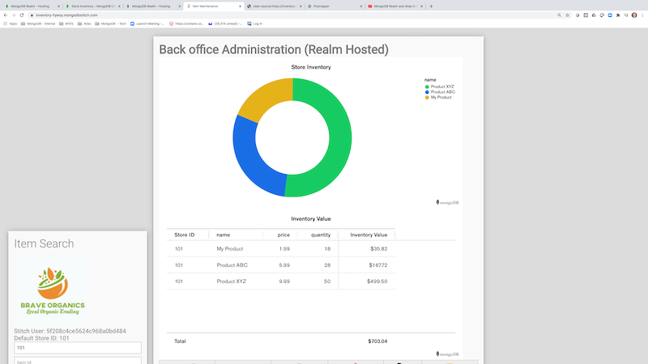</a>   

Start by inserting data into the __"InventoryItem"__ collection.  The easiest way to do this is through the __"Item Maintenance"__ window of the application, this is the __"index.html"__ file we uploaded in step 5. It can be accessd via https://<your-app-id>/mongodbstitch.com.  Click the __"REST API Add"__ button.  The addStoreItem.html file will open in a new tab with the default product information in a JSON document.  Modify the product name, price and other attributes to get enough data to build a chart.

Charts
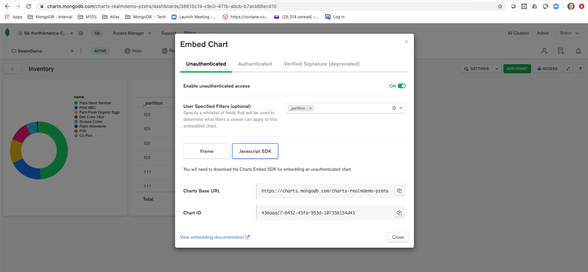  

Be sure to include the \_partition value in the chart when enabling the ability to embed the chart.

## Tutorial Contents 
[Overview](#-overview)
1. [Create the Atlas Cluster](#-create-an-atlas-cluster)
2. [Configure the RealmSync Project](#-configure-the-realmsync-project)
3. [Set up the mobile development environment](#-set-up-the-mobile-development-environment)
4. [Import the Back Office Application](#-import-the-back-office-application)
5. [Host the HTML](#--host-the-html)
6. [Set up Twilio](#--set-up-twilio)
7. [Set up Charts](#--set-up-charts)
8. [Integrate with Kafka](#--integrate-with-kafka)

##   Integrate with Kafka

If you are interested in using the Atlas Kafka connector through Confluent Cloud you will want to create an AWS cluster in East US 2

There are a number of good blog posts to get started:   

Confluent Cloud connector blogs:   
https://www.mongodb.com/blog/post/seamlessly-move-data-between-confluent-cloud-atlas   
https://www.confluent.io/blog/confluent-cloud-offers-kafka-mongodb-connector-fully-managed-clusters/   

Confluent blog site:
https://www.confluent.io/blog/getting-started-mongodb-connector-for-apache-kafka-and-mongodb/

8.1 Start by creating your confluent cloud cluster:
https://confluent.cloud/login

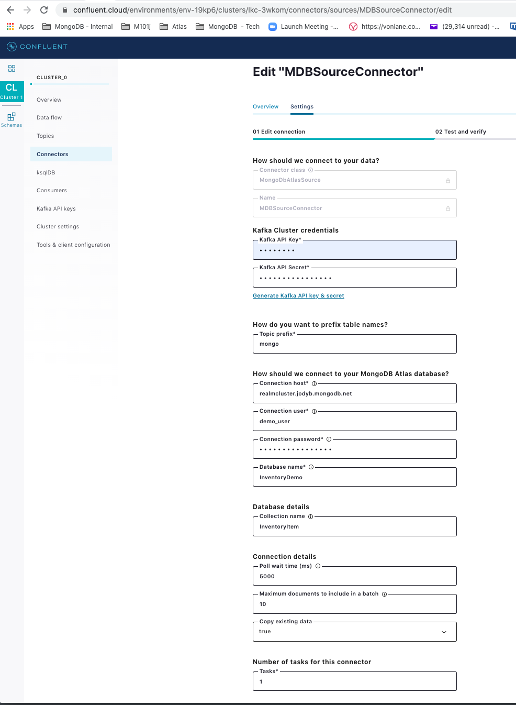 
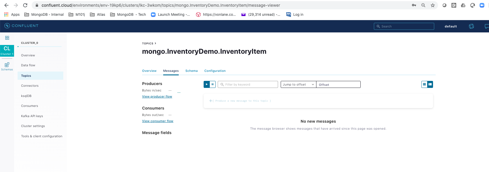 
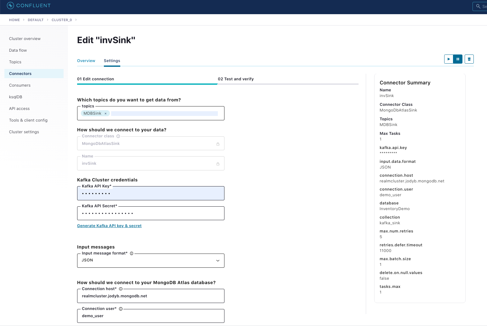 
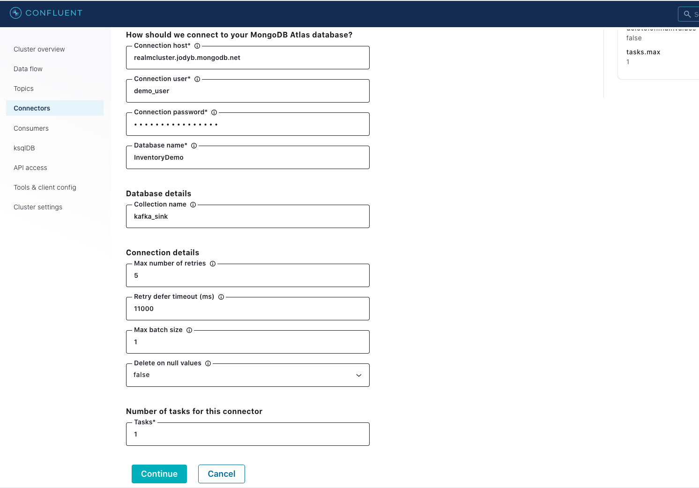 


## Tutorial Contents 
[Overview](#-overview)
1. [Create the Atlas Cluster](#-create-an-atlas-cluster)
2. [Configure the RealmSync Project](#-configure-the-realmsync-project)
3. [Set up the mobile development environment](#-set-up-the-mobile-development-environment)
4. [Import the Back Office Application](#-import-the-back-office-application)
5. [Host the HTML](#--host-the-html)
6. [Set up Twilio](#--set-up-twilio)
7. [Set up Charts](#--set-up-charts)
8. [Integrate with Kafka](#--integrate-with-kafka)
